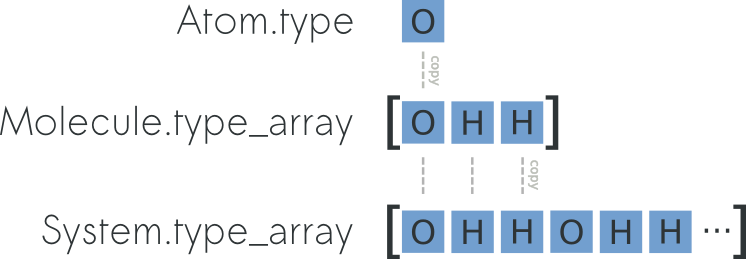

============================
Atoms, Molecules and Systems
============================

In chemlab, atoms can be represented using the
:py:class:`chemlab.core.Atom` data structure that contains some
common information about our particles like type, mass and
position. Atom instances are easily created by initializing them with
data ::

    >>> from chemlab.core import Atom
    >>> ar = Atom('Ar', [0.0, 0.0, 0.0])
    >>> ar.type
    'Ar'
    >>> ar.r
    np.array([0.0, 0.0, 0.0])

.. note:: for the atomic coordinates you should use nanometers

A :py:class:`chemlab.core.Molecule` is an entity composed of more
atoms and most of the Molecule properties are inherited from the
constituent atoms. To initialize a Molecule you can, for example, pass
a list of atom instances to its constructor::

    >>> from chemlab.core import Molecule
    >>> mol = Molecule([at1, at2, at3])

Manipulating Molecules
----------------------

Molecules are easily and efficiently manipulated through the use of
numpy arrays. One of the most useful arrays contained in Molecule is
the array of coordinates :py:attr:`Molecule.r_array`.  The array of
coordinates is a numpy array of shape ``(NA,3)`` where ``NA`` is the
number of atoms in the molecule.  According to the numpy broadcasting
rules, if you sum two arrays with shapes ``(NA,3)`` and ``(3,)``, each
row of the first array gets summed with the second array. Let's say we
have a water molecule and we want to displace it randomly in a box,
this is easily accomplished by initializing a Molecule at the
origin and summing its coordinates with a random displacement::

    import numpy as np
    
    wat = Molecule([Atom("H", [0.0, 0.0, 0.0]),
                    Atom("H", [0.0, 1.0, 0.0]),
                    Atom("O", [0.0, 0.0, 1.0])], bonds=[[2, 0], [2, 1]])
 
    # Shapes (NA, 3) and (3,)
    wat.r_array += np.random.rand(3)
    

Using the same principles, you can also apply other kinds of
transformations such as matrices.  You can for example rotate the
molecule by 90 degrees around the z-axis::

    from chemlab.graphics.transformations import rotation_matrix
    
    # The transformation module returns 4x4 matrices
    M = rotation_matrix(np.pi/2, np.array([0.0, 0.0, 1.0]))[:3,:3]

    # slow, readable way
    for i,r in enumerate(wat.r_array):
        wat.r_array[i] = np.dot(M,r)

    # numpy efficient way to do the same:
    # wat.r_array = np.dot(wat.r_array, M.T)

The array-based API provides a massive increase in performance and a
more straightforward integration with C libraries thanks to the numpy
arrays. This feature comes at a cost: the data is copied between atoms
and molecules, in other words the changes in the costituents atoms are
not reflected in the Molecule and vice-versa. Even if it may look a bit
unnatural, this approach limits side effects and makes the code more
predictable and easy to follow.

Bonds between atoms can be set or retrieved by using the
:py:class:`~chemlab.core.Molecule.bonds` attribute. It's an array of
integers of dimensions ``(nbonds, 2)`` where the integer value
corresponds to the atomic indices::

    >>> from chemlab.db import ChemlabDB
    >>> water = ChemlabDB().get('molecule', 'example.water')
    >>> water.bonds    
    array([[0, 1],
           [0, 2]])    

By using the `numpy.take`_ function it's very easy to extract
properties relative to the bonds. `numpy.take`_ lets you index an
array using another array as a source of indices, for example, we can
extract the bonds extrema in this way::

    >>> import numpy as np
    >>> np.take(water.type_array, n.bonds)
    array([['O', 'H'],
           ['O', 'H']], dtype=object)

If the array is not flat (like r_array), you can also specify the
indexing axis; the following snippet can be used to retrieve the bond
distances::

    # With water.bonds[:, 0] we take an array with the indices of the 
    # first element of the bond. And we use numpy.take to use this array
    # to index r_array. We index along the axis 0, along this axis
    # the elements are 3D vectors.
    >>> bond_starts = np.take(water.r_array, water.bonds[:, 0], axis=0)
    >>> bond_ends = np.take(water.r_array, water.bonds[:, 1], axis=0) 
    >>> bond_vectors = bond_ends - bond_starts
    
    # We sum the squares along the axis 1, this is equivalent of doint
    # x**2 + y**2 + z**2 for each row of the bond_vectors array
    >>> distances = np.sqrt((bond_vectors**2).sum(axis=1))
    >>> print(distances)
    [ 0.1         0.09999803]

Sometimes you don't want to manually input the bonds, but want to have
them automatically generated. In this case you may use the function 
:py:meth:`chemlab.core.guess_bonds` method::

    >>> water.bonds = guess_bonds(water)

.. _numpy.take: http://docs.scipy.org/doc/numpy/reference/generated/numpy.take.html

Systems
-------
 
In context such as molecular simulations it is customary to introduce
a new data structure called :py:class:`~chemlab.core.System`. A
*System* represents a collection of molecules, and optionally (but
recommended) you can pass also periodic box information::
 
   >>> from chemlab.core import System
   # molecule = a list of Molecule instances
   >>> s = System(molecules, cell_lengths=[2.0, 2.0, 2.0]) 
 
A *System* does not directly take *Atom* instances as its constituents,
therefore if you need to simulate a system made of single atoms (say,
a box of liquid Ar) you need to wrap the atoms into a Molecule::
 
   >>> ar = Atom('Ar', [0.0, 0.0, 0.0])
   >>> mol = Molecule([ar])
 
System, similarly to Molecule, can expose data by using arrays and it
inherits atomic data from the constituent molecules. For instance,
you can easily and efficiently access all the atomic coordinates by
using the attribute :py:attr:`System.r_array`. To understand the
relation between :py:attr:`Atom.r`, :py:attr:`Molecule.r_array` and
:py:attr:`System.r_array` you can refer to the picture below:
 

You can preallocate a `System` by using the classmethod
:py:meth:`System.empty <chemlab.core.System.empty>` (pretty much like
you can preallocate numpy arrays with `np.empty` or `np.zeros`) and specify 
dimensions that this system will have::

  # This could be a way to preallocate two water molecules
  s = System.empty(atom=6, molecules=2, bonds=4)
  # TODO
  s.type_array
  s.maps
  s.bonds  

Also, you can add a batch of molecules using the following code::
  
  with System.batch() as b:
    b.append(mol)

Preallocating and adding molecules is a pretty fast way to build a
`System`, but the fastest way (in terms of processing time) is to
build the system by passing ready-made arrays, this is done by using
:py:meth:`chemlab.core.System.from_arrays`.

Most of the :py:class:`chemlab.core.Molecule` array attributes are
still present in :py:class:`chemlab.core.System`, including
:py:attr:`System.bonds` that can be set automatically by using the 
:py:meth:`chemlab.core.guess_bonds` method.

Building Systems
................

Random Boxes
~~~~~~~~~~~~

It is possible to build boxes where atoms are placed randomly by using
the :py:meth:`chemlab.core.random_lattice_box` function. A set of
template molecules are copied and translated randomly on the points of
a 3d lattice. This ensures that the spacing between molecules is
consistent and to avoid overlaps.

To make an example box::

  from chemlab.db import ChemlabDB
  from chemlab.core import random_lattice_box
  
  # Example water molecule
  water = ChemlabDB().get('molecule', 'example.water')
  
  s = random_lattice_box([water], [1000], [4.0, 4.0, 4.0])

Crystals
~~~~~~~~

chemlab provides an handy way to build crystal structures from the
atomic coordinates and the space group information. If you have
the crystallographic data, you can easily build a crystal::

  from chemlab.core import Atom, Molecule, crystal
  from chemlab.graphics.qt import display_system
  
  # Molecule templates
  na = Molecule([Atom('Na', [0.0, 0.0, 0.0])])
  cl = Molecule([Atom('Cl', [0.0, 0.0, 0.0])])
  
  s = crystal([[0.0, 0.0, 0.0], [0.5, 0.5, 0.5]], # Fractional Positions
              [na, cl], # Molecules
	      225, # Space Group
	      cellpar = [.54, .54, .54, 90, 90, 90], # unit cell parameters
	      repetitions = [5, 5, 5]) # unit cell repetitions in each direction

  display_system(s)
	     
.. seealso:: :py:func:`chemlab.core.crystal`
	     
.. note:: If you'd like to implement a .cif file reader, you're
          welcome! Drop a patch on github.

Selections
..........

Subsetting systems in chemlab is extremely easy, the method
:py:meth:`chemlab.core.System.sub` takes care of that
with a very simple interface. In the following example
we obtain sub-molecules containing only c-alphas and oxygens from a protein::

  # TODO
  from chemlab.dataset import example_protein
  mol = example_protein()
  c_alphas = mol.sub(atom_name='CA')
  oxy = mol.sub(atom_name='O')

You can combine different selection statements to perform more advanced selections.
Another important method is :py:meth:`chemlab.core.System.where` that instead
of returning a sub-system or a sub-molecule, will return the indices corresponding
to the selection.

Another way of making selection is by using :py:meth:`chemlab.core.System.filter`
that will filter based on indices.

Trajectories
............

A simple trajectory object can be used to access and store trajectories. 
To load trajectory information at a certain frame into a System, 
it is sufficient to use the method Trajectory.at in combination of System.update::

  import numpy as np
  from chemlab.core import Trajectory
  
  n_frames = 10
  n_atoms = 100
  coords = np.random.rand(n_frames, n_atoms, 3)
  times = np.arange(0, 1, 0.01)
  traj = Trajectory(coords, times)
  
  system = System.empty(atom=n_atoms)
  system.update(traj.at(0))
  
Concatenation
.............

You can also create a system by merging two different systems. In the
following example we will see how to make a NaCl/H2O interface by
using :py:meth:`chemlab.core.System.concat`
::

  import numpy as np
  from chemlab.core import Atom, Molecule, crystal
  from chemlab.graphics.qt import display_system
   
  # Make water crystal
  wat = Molecule([Atom('O', [0.00, 0.00, 0.01]),
   	Atom('H', [0.00, 0.08,-0.05]),
   	Atom('H', [0.00,-0.08,-0.05])])
   
  water_crystal = crystal([[0.0, 0.0, 0.0]], [wat], 225,
       cellpar = [.54, .54, .54, 90, 90, 90], # unit cell parameters
       repetitions = [5, 5, 5]) # unit cell repetitions in each direction
   
  # Make nacl crystal
  na = Molecule([Atom('Na', [0.0, 0.0, 0.0])])
  cl = Molecule([Atom('Cl', [0.0, 0.0, 0.0])])
    
  nacl_crystal = crystal([[0.0, 0.0, 0.0], [0.5, 0.5, 0.5]], [na, cl], 225,
        cellpar = [.54, .54, .54, 90, 90, 90],
        repetitions = [5, 5, 5])
   
  water_half = water_crystal.filter(atom=water_crystal.r_array[:,0] > 1.2) 
  nacl_half = nacl_crystal.filter(atom=nacl_crystal.r_array[:,0] < 1.2)
   
  interface = water_half.concat(nacl_half)
  interface.display(backend='povray')

.. image:: /_static/merge_systems.png
    :width: 800px

Sorting
.......

It is possible to reorder the molecules or atoms in a System by using the
method :py:meth:`chemlab.core.System.reorder`. Reordering can be useful for example
to sort the molecules against a certain key.

Display
.......
