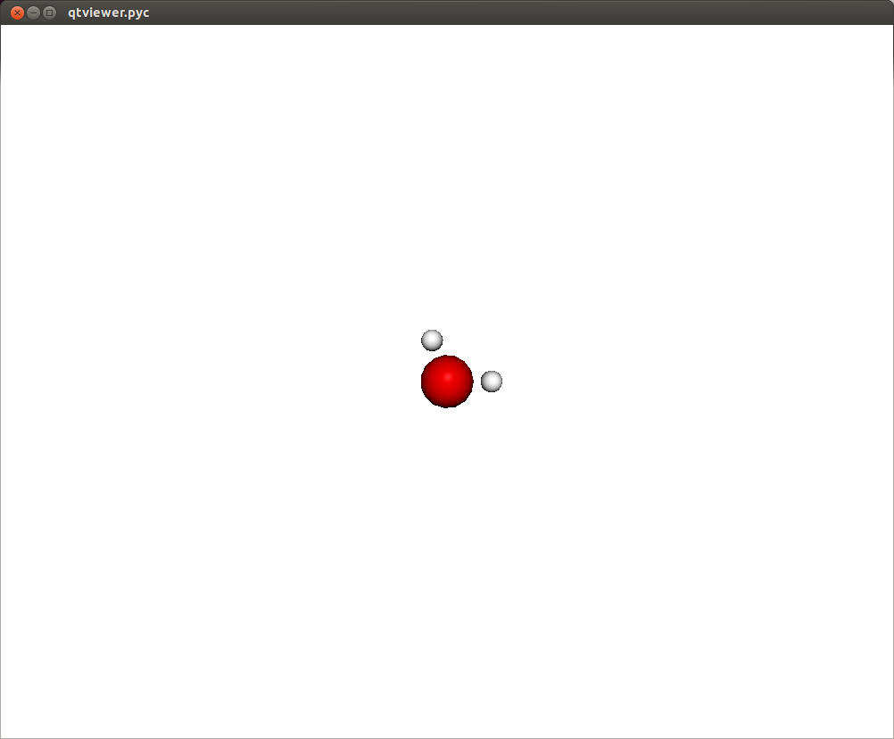
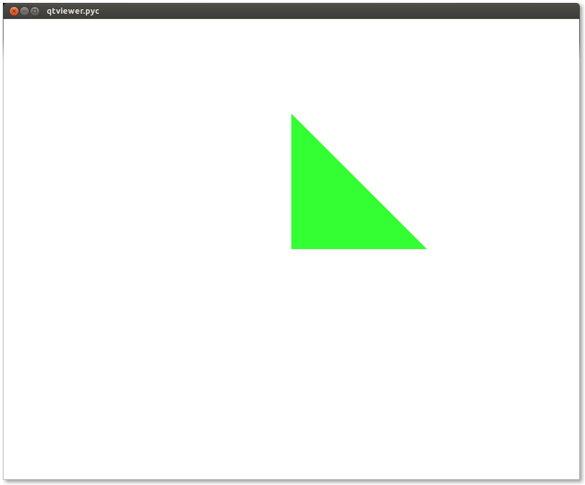
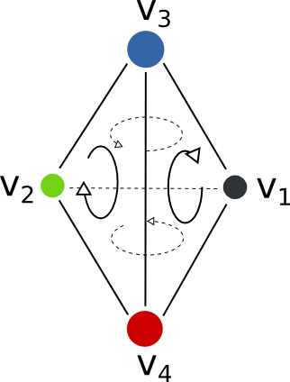
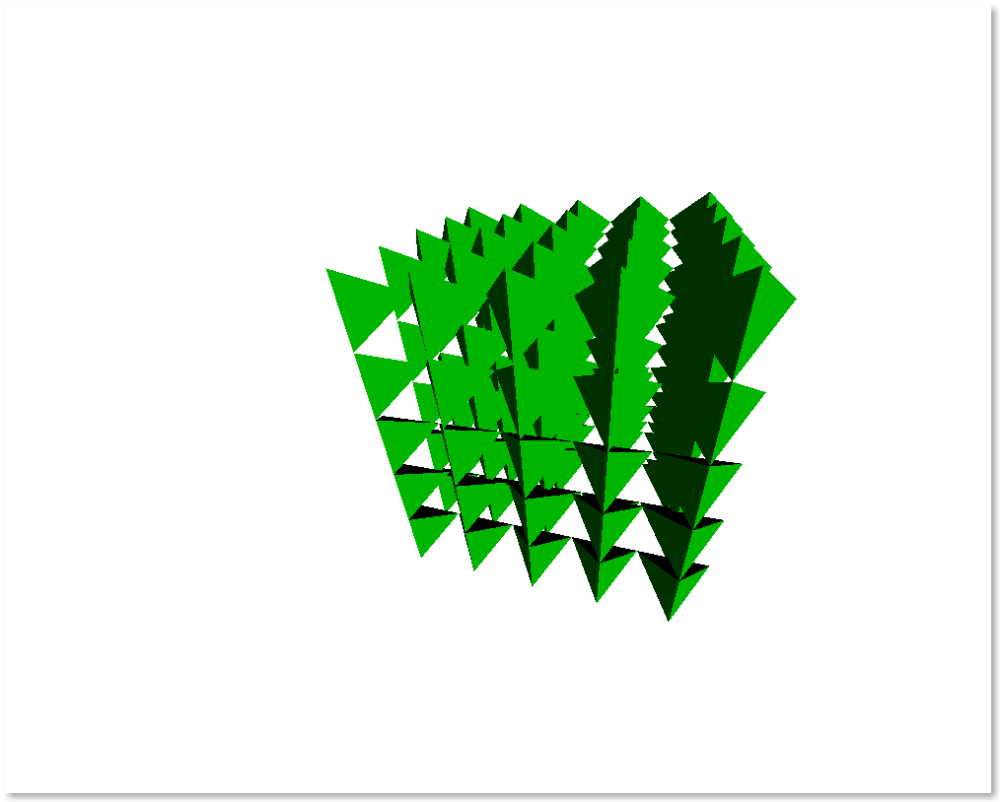

==========================
Graphics and Visualization
==========================

Intro
-----

The ``chemlab.graphics`` package is one of the most interesting
aspects of chemlab, that sets him apart from similar programs.

The purpose of the package is to provide a solid library to develop 3D
applications to display chemical data in an flexible way. For example
it's extremely easy to build a molecular viewer and add a bunch of
custom features to it.

The typical approach when developing a graphics application is to
create a :py:class:`~chemlab.graphics.QtViewer` instance and add 3D
features to it::

>>> from chemlab.graphics.qt import QtViewer
>>> v = QtViewer()

now let's define a molecule. We can use the `chemlab.db` module to get a
water template.

>>> from chemlab.graphics.renderers import AtomRenderer
>>> from chemlab.db  import ChemlabDB
>>> water = ChemlabDB().get('molecule', 'example.water')
>>> ar = v.add_renderer(AtomRenderer, water.r_array, water.type_array)
>>> v.run()

In this way you should be able to visualize a molecule where each atom
is represented as a sphere. There are also a set of viewing controls:

- **Mouse Drag (Left Click) or Left/Right/Up/Down**:   Rotate the molecule

- **Mouse Drag (Right Click)**:  Pan the view
    
- **Mouse Wheel or +/-**:  Zoom in/out

In a similar fashion it is possible to display other features, such as
boxes, cylinders, lines, etc.  It is useful to notice that with
``Viewer.add_renderer`` we are not passing an *instance* of the renderer, but
we're passing the renderer *class* and its respective constructor
arguments. The method ``Viewer.add_renderer`` returns the actual
instance.

It is possible as well to overlay 2D elements to a scene in a similar
fashion, this will display a string at the screen position 300, 300::

    from chemlab.graphics.uis import TextUI
    tui = v.add_ui(TextUI, 300, 300, "Hello, World!")
    
Anyway, I encourage you to use the powerful Qt framework to provide
interaction and widgets to your application.

Renderers
---------

Renderers are simply classes used to draw 3D objects. They are
tecnically required to provide just one method, *draw* and they must
take an instance of :py:class:`~chemlab.graphics.QChemlabWidget` as
their first argument (check out the
:py:class:`~chemlab.graphics.renderers.AbstractRenderer` class). In
this way they provide the maximum flexibility required to build
efficient opengl routines. Renderers may be subclass other renderers
as well as use other renderers.

A very useful renderer is
:py:class:`~chemlab.graphics.renderers.TriangleRenderer`, used to
render efficiently a list of triangles, it constitutes a basis for
writing other renderers. TriangleRenderer works like this:
you pass the vertices, normals and colors of the triangles and it will
display a set of triangles in the world::

    from chemlab.graphics.qt import QtViewer
    from chemlab.graphics.renderers import TriangleRenderer
    from chemlab.graphics.colors import green
    import numpy as np
     
    vertices = np.array([[0.0, 0.0, 0.0], [0.0, 1.0, 0.0], [1.0, 0.0, 0.0]])
    normals = np.array([[0.0, 0.0, 1.0], [0.0, 0.0, 1.0], [0.0, 0.0, 1.0]])
    colors = np.array([green, green, green])
     
    v = QtViewer()
    v.add_renderer(TriangleRenderer, vertices, normals, colors)
    v.run()

		   
If you pass 6 vertices/normals/colors, it will display 2 triangles and
so on. As a sidenote, it is very efficient and in fact
:py:class:`chemlab.graphics.renderers.TriangleRenderer` is used as a
backend for a lot of other renderers such as
:py:class:`~chemlab.graphics.renderers.SphereRenderer` and
:py:class:`~chemlab.graphics.renderers.CylinderRenderer`. If you can
reduce a shape in triangles, you can easily write a renderer for it.

In addition to that, ``TriangleRenderer`` provides also a method to update
vertices, normals and colors. We can demonstrate that from the last
example by defining an update function that rotates our triangle::
  
  from chemlab.graphics.transformations import rotation_matrix

  def update():
      y_axis = np.array([0.0, 1.0, 0.0])
      
      # We take the [:3,:3] part because rotation_matrix can be used to 
      # rotate homogeneous (4D) coordinates. 
      rot = rotation_matrix(3.14/32, y_axis)[:3, :3]
   
      # This is the numpy-efficient way of applying rot to each coordinate
      vertices[:] = np.dot(vertices, rot.T)
      normals[:] = np.dot(vertices, rot.T)
      
      tr.update_vertices(vertices)
      tr.update_normals(normals)
      v.widget.update()
   
  v.schedule(update, 10)
  v.run()

Post Processing Effects
-----------------------

.. versionadded:: 0.3

Post processing effects are a great way to increase the visual quality
of your representations. Those effects are applied after the scene is
rendered and they can be applied one after each other to achieve a
combination of effects.

Applying a post processing effect is extremely easy. Let's see we are
viewing a big molecule with lots of pockets, such as a protein. Grab
the protein `3ZJE
<https://github.com/chemlab/chemlab-testdata/raw/master/3ZJE.pdb>`_ ,
load it into chemlab and display it using a simple Van der Waals
representation::

    from chemlab.graphics.qt import QtViewer
    from chemlab.graphics.renderers import AtomRenderer
    from chemlab.io import datafile

    protein = datafile("3ZJE.pdb").read("molecule")
    v = QtViewer()
    v.add_renderer(AtomRenderer, protein.r_array, protein.type_array)
    v.run()

You'll get a representation like this:

.. image:: /_static/ssao_off.png
    :width: 600px

This representation doesn't really show the molecule surface
features, plus it looks dull and plasticky. We can add the screen space ambient occlusion effect to improve its visual quality.

`Screen space ambient occlusion (SSAO)
<http://en.wikipedia.org/wiki/Screen_space_ambient_occlusion>`_ is a
very powerful technique used by numerous videogames to make the
illumination much more realistic, by darkening the more occluded areas
of the objects, such as pockets and surface features.

Chemlab implements this effect in the
:py:class:`~chemlab.graphics.postprocessing.SSAOEffect` class. To
apply it to the scene it's sufficient to add this simple line::

  from chemlab.graphics.postprocessing import SSAOEffect
  
  v.add_post_processing(SSAOEffect)
  v.run() 

What you'll get is this, with a much-improved visual quality:

.. image:: /_static/ssao_on.png
    :width: 600px

Post processing effects can be customized with arguments. The
SSAO effect may have a dirty look, you can fix that by changing the
parameter kernel_size, which default to 32, with a max value of 128::

  v.add_post_processing(SSAOEffect, kernel_size=128)

This will improve the visual quality at the cost of decreased
performance. To see all the options available take look at the api
documentation :doc:`api/chemlab.graphics.postprocessing`.

Post processing effects can also be stacked on top of each other. If
your computer is powerful enough, you can load your scene with a stack
of effects that will be applied in turn::

  from chemlab.graphics.postprocessing import SSAOEffect
  from chemlab.graphics.postprocessing import OutlineEffect  
  from chemlab.graphics.postprocessing import FXAAEffect
  from chemlab.graphics.postprocessing import GammaCorrectionEffect
  
  v.add_post_processing(SSAOEffect) # better illumination
  v.add_post_processing(OutlineEffect) # black outlines
  v.add_post_processing(FXAAEffect) # fast antialiasing
  v.add_post_processing(GammaCorrectionEffect) # color correction
  
  v.run()

.. image:: /_static/multi_effects.png
    :width: 600px

Unfortunately on ATI cards with open source drivers can't apply
multiple post processing effects. I'm investigating the issue, but
this can be potentially due to a bug in the drivers.

.. seealso:: :doc:`api/chemlab.graphics.postprocessing`

Offline Rendering
-----------------

.. versionadded:: 0.3

With chemlab you can produce renderings programmatically without
having to display anything or tinkering with the user interface. This
feature comes pretty useful when generating reports with a lot of
pictures.

Let's say you want to make a showcase of different chemical compounds,
such as the first four alkanes. First of all we'll take a sample
molecule to adjust the looks and then we'll adapt the code to render
all of the alkanes in a sequence.

As an example we'll tweak our rendering on the norbornene molecule
contained in the chemlab database::

    from chemlab.db import ChemlabDB
    cdb = ChemlabDB()
    
    norb = cdb.get("molecule", "example.norbornene")

We want to do the rendering of this molecule using a space fill
representation, this can be achieved by using the AtomRenderer, which
will render each atom as a sphere with its Van Der Waals radius::

    from chemlab.graphics.qt import QtViewer
    from chemlab.graphics.renderers import AtomRenderer
    
    v = QtViewer()
    atom_rend = v.add_renderer(AtomRenderer, norb.r_array, norb.type_array)
    
After we've got the renderer in place we can programmatically
manipulate the camera to adjust at the right zoom level. You can, for
instance, use the :meth:`chemlab.graphics.camera.Camera.autozoom`
method to automatically adjust the scene, but you are free to use any
other method present in the :class:`~chemlab.graphics.camera.Camera`
class::

    v.widget.camera.autozoom(norb.r_array)
    
    v.run()

.. image:: /_static/norb_step1.png

At this point, you are free experiment with different effects and
combinations. In our case we'll add SSAO and anti aliasing to add more
depth and smoothness to the rendering::

    from chemlab.graphics.postprocessing import SSAOEffect, FXAAEffect
    
    v.add_post_processing(SSAOEffect, kernel_size=128, kernel_radius=1.0)
    v.add_post_processing(FXAAEffect)
    
    v.run()

.. image:: /_static/norb_step2.png

To actually save the image you can now use the
:py:meth:`chemlab.graphics.QChemlabWidget.toimage` method and select a
resolution of 800x800 pixels. This will return a PIL image, that has a
save method to store it as a png::
      
    img = v.widget.toimage(800, 800)
    img.save("norb.png")
 
Once we've got the sample molecule up and running it's very easy to
automatize the process to produce images of different molecules. In
the following code we prepare the QtViewer with the effects,
we call ``v.widget.initializeGL()`` in place of ``v.show()`` and for
each molecule we add an AtomRenderer and adjust the camera::

    from chemlab.db import CirDB
    from chemlab.graphics.qt import QtViewer
    from chemlab.graphics.renderers import AtomRenderer
    from chemlab.graphics.postprocessing import FXAAEffect, SSAOEffect
     
    # A series of compounds to display
    compounds = ["methane", "ethane", "propane", "butane"]
     
    db = CirDB()
     
    # Prepare the viewer
    v = QtViewer()
    v.widget.initalizeGL() # Needed if you don't call show()
    v.add_post_processing(SSAOEffect, kernel_size=128, kernel_radius=1.0)
    v.add_post_processing(FXAAEffect)
     
    for compound in compounds:
        mol = db.get("molecule", compound)
        rend = v.add_renderer(AtomRenderer, mol.r_array, mol.type_array)
        
        v.widget.camera.autozoom(mol.r_array)
        # Give some extra zoom
        v.widget.camera.mouse_zoom(1.0)
        
        v.widget.toimage(300, 300).save(compound + '.png')
        
        # Cleanup
        v.remove_renderer(rend)

.. image:: /_static/offline_rendering/methane.png
	   
.. image:: /_static/offline_rendering/ethane.png	   

.. image:: /_static/offline_rendering/propane.png	   
	   
.. image:: /_static/offline_rendering/butane.png	   

This example is stored in the ``chemlab/examples/offline_rendering.py`` file.
 

Tutorial: TetrahedronRenderer
-----------------------------

.. note:: This section is mainly for developers.

In this section, we'll see how to write a renderer that will display
several tetrahedrons. We will write our TetrahedronRenderer based on
TriangleRenderer. To do that we first need to understand how a
tetrahedron is made, and how can we define the vertices that make the
tetrahedron.

First of all, we need to have the 4 coordinates that represents a
tetrahedron. Without even trying to visualize it, just pick the values
straight from `Wikipedia <http://en.wikipedia.org/wiki/Tetrahedron>`_::

    import numpy as np
    v1 = np.array([1.0, 0.0, -1.0/np.sqrt(2)])
    v2 = np.array([-1.0, 0.0, -1.0/np.sqrt(2)])
    v3 = np.array([0.0, 1.0, 1.0/np.sqrt(2)])
    v4 = np.array([0.0, -1.0, 1.0/np.sqrt(2)])
    
We can quickly verify if this is correcty by using a
:py:class:`~chemlab.graphics.renderers.PointRenderer`::
   
    from chemlab.graphics.qt import QtViewer
    from chemlab.graphics.renderers import PointRenderer
    from chemlab.graphics.colors import black, green, blue, red

    colors = [black, green, blue, red]
    v = QtViewer()
    v.add_renderer(PointRenderer, np.array([v1, v2, v3, v4]), colors)
    v.run()

We've got 4 boring points that look like they're at the vertices of a
tetrahedron. Most importantly we learned that we can use PointRenderer
to quickly test shapes.

Now let's define the four triangles (12 vertices) that represent a
solid tetrahedron. It is good practice to put the triangle vertices in
a certain order to estabilish which face is pointing outside and which
one is pointing inside for optimization reasons. The convention is
that if we specify 3 triangle vertices in clockwise order this means
that the face points outwards from the solid:
   

We can therefore write our vertices and colors::

    vertices = np.array([
        v1, v4, v3,
        v3, v4, v2,
        v1, v3, v2,
        v2, v4, v1
    ])
    
    colors = [green] * 12
    
All is left to do is write the normals to the surface at each
vertex. This is easily done by calculating the cross product of the
vectors constituting two sides of a triangle (remember that the
normals should point outward) and normalize the result::
  
    n1 = -np.cross(v4 - v1, v3 - v1)
    n1 /= np.linalg.norm(n1)
    
    n2 = -np.cross(v4 - v3, v2 - v3)
    n2 = np.linalg.norm(n2)
    
    n3 = -np.cross(v3 - v1, v2 - v1)
    n3 /= np.linalg.norm(n3)
    
    n4 = -np.cross(v4 - v2, v1 - v2)
    n4 /= np.linalg.norm(n4)

    normals = [n1, n1, n1, 
               n2, n2, n2,
               n3, n3, n3,
               n4, n4, n4]
   
    from chemlab.graphics.renderers import TriangleRenderer
    
    v.add_renderer(TriangleRenderer, vertices, normals, colors)
    v.run()

Now that we've got the basic shape in place we can code the actual
Renderer class to be used directly with the viewer. We will make a
renderer that, given a set of coordinates will display many tetrahedra.

We can start by defining a Renderer class, inheriting from
AbstractRenderer, the main thing you should notice is that you need an
additional argument `widget` that will be passed when you use the
method `QtViewer.add_renderer`::

    from chemlab.graphics.renderers import AbstractRenderer
    
    class TetrahedraRenderer(AbstractRenderer):
        def __init__(self, widget, positions):
            super(TetrahedraRenderer, self).__init__(widget)
            ...

The strategy to implement a multiple-tetrahedron renderer will be like
this:

- store the triangle vertices, and normals of a single tetrahedra.
- for each position that we pass, translate the vertices of the single
  tetrahedra and accumulate the obtained vertices in a big array.
- repeat the normals of a single tetrahedra for the number of
  tetrahedra we're going to render.
- generate the per-vertex colors (green for simplicity)
- create a TriangleRenderer as an attribute and initialize him with
  the accumulated vertices, normals, and colors
- reimplement the *draw* method by calling the draw method of our
  trianglerenderer.
  
You can see the code in this snippet::

    class TetrahedraRenderer(AbstractRenderer):
        def __init__(self, widget, positions):
            super(TetrahedraRenderer, self).__init__(widget)
            
            v1 = np.array([1.0, 0.0, -1.0/np.sqrt(2)])
            v2 = np.array([-1.0, 0.0, -1.0/np.sqrt(2)])
            v3 = np.array([0.0, 1.0, 1.0/np.sqrt(2)])
            v4 = np.array([0.0, -1.0, 1.0/np.sqrt(2)])
     
            positions = np.array(positions)
            
            # Vertices of a single tetrahedra
            self._th_vertices = np.array([
                v1, v4, v3,
                v3, v4, v2,
                v1, v3, v2,
                v2, v4, v1
            ])
            
            self._th_normals = np.array([
                n1, n1, n1,
                n2, n2, n2,
                n3, n3, n3,
                n4, n4, n4])
            
            self.n_tetra = len(positions)
            
            tot_vertices = []
            for pos in positions:
                tot_vertices.extend(self._th_vertices + pos)
            
	    # Refer to numpy.tile, this simply repeats the elements
            # of the array in an efficient manner.
            tot_normals = np.tile(self._th_normals, (self.n_tetra, 1))
            tot_colors = [green] * self.n_tetra * 12
            
	    # !NOTICE! that we have to pass widget as the first argument
            self.tr = TriangleRenderer(widget, tot_vertices,
                                      tot_normals, tot_colors)
            
        def draw(self):
            self.tr.draw()

To demostrate let's draw a grid of 125 tetrahedra::

    positions = []
     
    for x in range(5):
        for y in range(5):
            for z in range(5):
                positions.append([float(x)*2, float(y)*2, float(z)*2])
     
    v.add_renderer(TetrahedraRenderer, positions)
    v.widget.camera.position = np.array([0.0, 0.0, 20.0])
    v.run()

		  

If you had any problem with the tutorial or you want to implement
other kind of renderers don't exitate to contact me. The full code of
this tutorial is in `chemlab/examples/tetrahedra_tutorial.py`.
