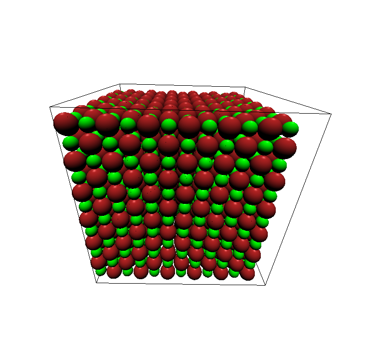

===========================
Installation and Quickstart
===========================

chemlab is currently tested on Ubuntu 12.10. First
install the dependencies::

    $ sudo apt-get install python-numpy python-scipy python-matplotlib python-pyside python-opengl cython 

Download chemlab and install it from the setup.py included in the
package::

    $ sudo python setup.py install

Test the newly installed package by typing::

    $ chemlab view tests/data/licl.gro

The molecular viewer should display a crystal, if not, file an issue
on `github <http://github.com/chemlab/chemlab/issues>`_.

Once you're setup you're ready to to dig in chemlab's
features contained in the :ref:`user-manual`.

Developement
------------

After installing the dependencies, grab the chemlab source from git::

    $ git clone --recursive https://github.com/chemlab/chemlab.git
   
Complile the included extensions::

    $ python setup.py build_ext --inplace

Just add the chemlab directory to the PYTHONPATH in your .bashrc::

    export PYTHONPATH=$PYTHONPATH:/path/to/chemlab
