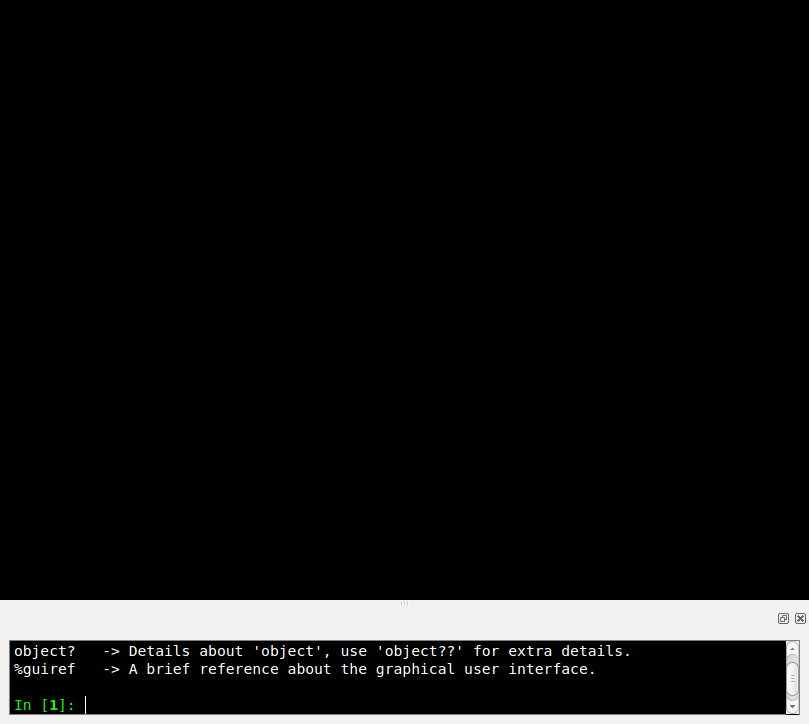
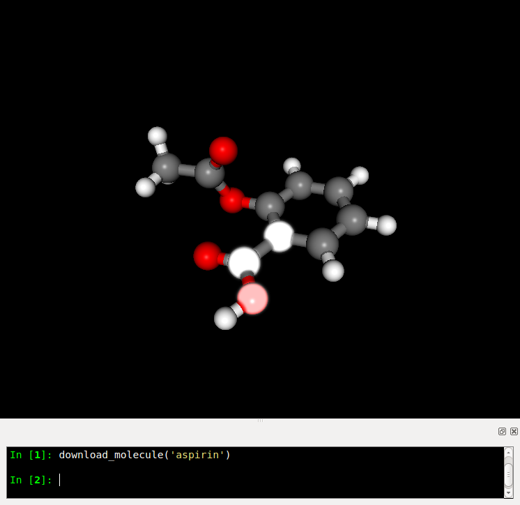
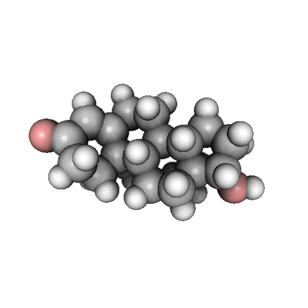

================
Molecular Viewer
================

The Chemlab molecular viewer is novel way for interacting, editing and
analyzing chemical data. The chemlab philosophy is that the program
should be really easy to extend; there are so many applications in
chemistry and physics and the user shouldn't be limited to the built-in
functionalities of the program.

Quick Start
===========

You can start the chemlab molecular viewer by typing::

    chemlab view

This will load the user interface consisting of the viewer, and an
IPython shell.

You can start typinc commands in the IPython shell and changes will
appear immediately in the viewer. Downloading a molecule from the web
is really easy with the command
:py:func:`chemlab.mviewer.api.download_molecule`::

   download_molecule('aspirine')

You can select atoms by clicking on them. The selection effect
is a white glow.

The molecular viewer can be used to perform some simple tasks
programmatically.

Changing the Appeareance
========================

Chemlab can make seriously good-looking pictures. 

The general way the appeareance-related function work is that they
apply on selections. Say, you want the change all the Carbon atom
colors to black.

This is really easy to do::

  select_atom_type('C')
  change_color('black')

The colors available as string are the standard `HTML colors
<http://www.w3schools.com/html/html_colornames.asp>`_, written in
underscore.

You can also pass rgba tuples in the range 0-255. Please, leave the
alpha value to 255::

  select_atom_type('C')
  change_color((0, 0, 0, 255))

Similarly you can change the radius of certain atoms or scale them::

  select_all()
  scale_atoms(2.0) # Scale Factor
  change_radius(0.15) # Exact value in nm
  
Perhaps the most interesting feature are the post processing effects,
the most interesting is called 'ssao' or Screen Space Ambient
Occlusion. It enhances the picture by giving nice shadows in the more
occluded areas, take a look at the picture generated by this code::
  
  download_molecule('testosterone')
  
  select_all()
  scale_atoms(2.0)
  
  # We make the colors brighter, ssao works best on light colors.
  
  select_atom_type('C')
  change_color((210, 210, 210, 0)) # That's a very light gray
  
  select_atom_type('O')
  change_color((255, 163, 163, 255))
  
  change_background('white')
  
  pp_id = add_post_processing('ssao')
  
  # For max quality 
  # add_post_processing('ssao', kernel_size=128)

There is a good amount of shadows, you can also setup other effects
such as anti aliasing and gamma correction::

  add_post_processing('fxaa')
  add_post_processing('gamma')

The function :py:func:`~chemlab.mviewer.api.appeareance.add_post_processing`
returns a string id that you can use to remove the effect or to change
its options. To list all the available post processing effects, use
the function :py:func:`~chemlab.mviewer.api.appeareance.list_post_processing`::

  list_post_processing()
  # ['ssao1', 'fxaa2', 'gamma3']
  change_post_processing_options('ssao1', kernel_size=128)
  remove_post_processing('fxaa2')
  clear_post_processing()

Loading Data
============

The Chemlab molecular viewer provides quite handy function to load
some data into it::

  load_system("file.gro")
  load_molecule("file.cml")

You can also download the molecule from a web database by its common
name::
  
  download_molecule('aspirine')

Or you can also download and open a file from a remote location using
directly its URL::
  
  load_remote_system('https://raw.github.com/chemlab/chemlab-testdata/master/naclwater.gro')
  load_remote_molecule('https://raw.github.com/chemlab/chemlab-testdata/master/benzene.mol')

Loading Trajectories
....................

Chemlab supports the loading of trajectory files (for example the xtc
files from GROMACS). After you load a system you can attach some
trajectory data with load_trajectory or load_remote_trajectory::

  load_system('water.gro')
  load_trajectory("traj.xtc")
  
We can run a small test using the test files from chemlab::

  load_remote_system('https://raw.github.com/chemlab/chemlab-testdata/master/water.gro')
  load_remote_trajectory('https://github.com/chemlab/chemlab-testdata/raw/master/trajout.xtc')

A series of commands will appear, and you can move through the
trajectory by dragging the bar or the Play/Stop button.

You can also move programmatically using the function goto_time and
goto_frame and inspect with the functions current_time and current_frame

Selections
==========

In Chemlab you select and operate on atoms and bonds.

You can use the built-in functions to select according to various
types::

  select_atoms([0, 1, 2])
  select_atom_type('Na')
  select_molecules('H2O')
  select_all()
  select_within([0, 1], 0.2)
  
You can also act on the selection in different ways::

  invert_selection()
  clear_selection()

Each selection routine returns a :class:`~chemlab.mviewer.Selection`
object, that contains information on the selection state, so you can
use it later::

  select_atoms([0, 1, 2])
  Selection([0, 1, 2], tot=6)

The :py:func:`~chemlab.mviewer.Selection` Selection objects have an API to be combined. For example if you
want to select Na and Cl atoms you can do in this way, using the function
:py:func:`~chemlab.mviewer.api.select_selection`::

  na_at = select_atoms('Na')
  cl_at = select_atoms('Cl')
  select_selection({'atoms' : na_at.add(cl_at)})
    
You can retrieve the currently selected atoms and bonds indices in
the following way::

  selected_atoms()
  selected_bonds()

Hiding and Showing
==================
   
Sometimes you want to hide certain objects from the current view to
remove clutter. For example if you want to select all the water
molecules and hide them::

  select_molecules('H2O')
  hide()

There's also a conveniency function to do this::

  hide_water()
  
You can also select hidden objects and show them::

  select_hidden()
  show()

Writing your own commands
=========================

The built-in commands provide a quick and easy way to operate on your
molecules and they provide basic functionality. The true power of chemlab
relies in the possibility to write and load your commands using the power
and simplicity of Python.

For example we can write a command that calculates automatically the
distance between two selected atoms. We can open a file *utils.py* and
put the following code in it::

  import numpy as np
  
  def distance():
     sel = selected_atoms()
     if len(sel) != 2:
         print("Only two atoms must be selected")
	 return
     else:
         # Here we use numpy fancy indexing
         a, b = current_system().r_array[sel]
	 return np.linalg.norm(b - a)

How can we access this function from a chemlab session?

The chemlab shell is just a regular Python shell, so one solution will
be to simply add the directory to your ``PYTHONPATH`` and import it manually.

However, chemlab provides an init file that lets you write some code
that will be called at initialization time.

The file is stored in the path ``.chemlab/scripts/__init__.py``. To
automatically load the command ``distance`` we have to first put the
file utils.py in the directory ``.chemlab/scripts/`` and add the
following line to the ``__init__`` file ::
  
  from .utils import distance

You can easily write and hook in a lot of extensions. Please write
something useful (You will!) and attach your code on the chemlab
github page
https://github.com/chemlab/chemlab/issues?labels=extension&milestone=&state=open

Select within a radius
......................

In this section we'll see another example on how to implement a new function in
chemlab. We want to select all the atoms within a certain
distance from the currently selected atoms. We can create a file in
the directory ~/.chemlab/scripts/distances.py and we will implement a
function like this that will operate on the current selection::

    def select_within(radius):
        pass

The implementation will be as follows::

  for each atom:
      find the neighbours atoms
      select them

In chemlab term we have to do this (the implementation is a bit
inefficient, but it's more readable)::

  from chemlab.mviewer.toolboxes.selection import selected_atoms

  def select_within(radius):
    neighbours = []
    
    for i_central in selected_atoms():
      r_central = current_system().r_array[i_central]
      
      for r in current_system().r_array:
         dist = np.linalg.norm(r - r_central)
	 if dist < radius:
              neighbours.append(i)
    
    select_atoms(np.unique(neighbours))
    
Now let's test how this works in a chemlab session. First of all let's add automatically the function to the file .chemlab/scripts/__init__.py::

  from .myutils import select_within
  
Now when you start chemlab this command will be made available immediately.

Distance between two atoms
..........................

In this section we will see how to use chemlab to find the interatomic
distance between two selected atoms using the core functions.

Chemlab gives you some basic functions to change and retrieve
information of what's currently displayed in the view.

For example, to get the current :class:`~chemlab.core.System` instance
being displayed you can type::

  current_system()

If you want to know which are the indexes of the atoms currently
selected you can type the following command::
  
  selected_atoms()
  # array([ 0,  1])

You can also do the reverse, given the indexes you can select two
atoms, the interface will update accordingly::

  select_atoms([0, 1])

To calculate the distance between the selected atoms, we have to first
retrieve their indexes and then use the System to retrieve their
coordinates. At that point we can use them to find the distance (it's
the norm of the difference between the two coordinates)::

  selected = selected_atoms()
  s = current_system()
  a, b = s.r_array[selected]
  import numpy as np
  distance = np.linalg.norm(a - b)
